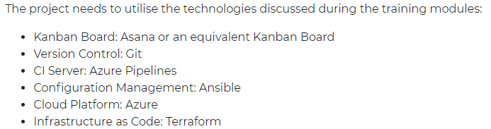

# README

# Avanade Practical Project

---

This readme file serves as my documentation for the Avanade practical project I worked on.

The task for the project is to build:

- an application that generates "Objects" upon a set of predefined rules

The application must conform with these rules:

The idea for the project can be from whatever domain one wishes' For example: 

- Account number and prize generator.
- D&D style character generator.
- Theme and setting generator for short stories.
- Data generator to seed a new Database
- Magic 8 Ball
- Fortune Teller

business case, such as a library or supermarket system, or something to do with a hobby of yours.

This is purposefully open to endorse creativity and allow us to do a project that we have full command over. It is in our interest do something we are passionate about, as experience has shown these to be the best projects.

# Cards Against Humanity Card Generator (CAHCG)

---

# Introduction

---

Every step of the software development cycle responsible for making CAHCG possible is detailed within this document. Emphasis is laid on the DevOps side of the project, specifically the automation of the continuous deployment, integration and testing of the application and cloud infrastructure. 

CAHCG is a simplified version of the popular card against humanity game where, every round, one player asks a question from a black card, and everyone else answers with their funniest white card. In this version , a black and white card are randomly selected from a deck of card and paired together to spell out what is hopefully a funny sentence.

# Requirement

---

There were a  list of requirements the project  had to adhere to. They can be found in the image below

In addition to the requirements, the application must also consist of at least 4 services:

- A service to return any object I desire (Service 1)
- A second service to return any second object I desire (Service 2)
- A third service that creates and returns an object based on the objects from the previous two services (Service 3/Merge Service)
- A last service which runs the frontend and displays the object from the third service (Service 4 / Frontend Service)

Lastly, there should be two implementation of the application. The reason for this is so that on the of the presentation, after merging the branch with the second implementation to the main branch, the change is reflected in the web application without it going down.

# Project Management

---

I used a Trello board for managing the project's user stories and keeping on top my progress. The Trello board made tracking of these features and managing the project easy.

The image above shows one half of the trello board used in managing the tasks completed within this project.

- User stories - refers to features required by the user. Contained within the user stories are pieces of work directly required to complete the user story. User stories are colour coded yellow
- Current sprint backlog - contains the user stories and tasks scheduled for a sprint. These user stories and tasks are yet to be worked on
- Sprint in progress - refers to user stories and tasks that are currently being worked

The image above shows the second half of the trello board used in managing the tasks completed within this project.

- Done - this column has all the completed user stories and tasks
- Test - the test column contains all the tests completed in the project
- Bugs - refers to issues being faced within the project. Bugs would usually be task specific

# Risk Assessment

---

The risk assessment matrix below describes the potential risks identified throughout the life of the project. In addition to each risk, It also includes the likelihood of the said risk happening, the severity of the risk if it does happen and the measure put in place to control the impact of the risk. A revisit column was added to ensure that each risk is re-evaluated continuously throughout the project and importantly in light of the current state of the project at the time of evaluation. 

# Architecture

---

The project specification provides enough clues to suggest that the desired way to design the application is using a `Microservice Architecture`.  According to [Microsoft](https://docs.microsoft.com/en-us/azure/architecture/guide/architecture-styles/microservices), a  microservice architecture is  "a collection of small, autonomous services. Each service is self-contained and should implement a single business capability within a bounded context." Microservice architecture provides benefits which includes increased development agility because microservices are deployed independently an therefore bug fixes feature releases are easier to manage compared to a monolithic architecture. Also teams have the options to choose the best technology stack for the services they are building.

The microservice architecture for the card against humanity card generator consists of 5 services as shown in the image above. There is a frontend, merge, question. answer and card service.

## Frontend Service

This service makes calls to the merge service and pushes the returned object to the appropriate view. The service is built using Angular and it consists of two views; a homepage view and a game view.

The homepage view displays some information regarding what the game card against humanity is and how it is played. It also shows two links, one leads back to the official CAH store to buy the cards and the other to download the cards for free. The button in the view leads to the game view.

# #######IMAGE OF GAME VIEW#########

### ###########DESCRIPTION OF THE GAME VIEW#############

 

## Merge, Question and Answer Service

The three services were built using [ASP.NET](http://asp.NET) Core's Web API framework.  Each service has a class called a controller and in it are methods that are called when requests are made to the services.  Each API service performs a single job. The merge service makes requests to the answer and question service and then returns a JSON of the result of both services concatenated. The answer service makes calls to the card service and returns an answer card in a JSON format. Similarly, the question service makes calls to the card service and returns a question card in a JSON format.

## Card Service

The card service is an extra service I created in order to serve my downstream services, specifically the answer and question service. The application is built in Node JS and has two endpoints. One of the endpoints serves all calls for a question and the second serves all calls for an answer card. The applications reads from a JSON file and returns it to the calling API.

# CI/CD Pipeline

According to [Red Hat](https://www.redhat.com/en/topics/devops/what-cicd-pipeline), a CI/CD pipeline is "a series of steps that must be performed in order to deliver a new version of software" and the practice focuses on improving software delivery using DevOps or SRE. In this project, an automated CI/CD pipeline was used in integrating and deploying new versions of the cards against humanity card generator.  This was achieved through the use of GitHub Actions and its hosted runners. 

As shown in the image above, a merge with or push to the main branch kickstarts the CI/CD pipeline. The merge or push event triggers the GitHub Actions service which provisions a GitHub hosted runner.  The runner then runs the jobs described in a yaml file found within the .github/workflows/cah_deploy file and deploys the application in the process. 

The pipeline comprises of 4 jobs , see below:

- Dotnet Testing Job
- Terraform Job
- Ansible Job
- Docker Job

## Dotnet Testing Job

This job is part of the the continuous integration portion of the pipeline. When a new version of the code is pushed/merged with the main branch, this job installs all the required dependencies, builds the application, runs the tests and publishes it to the merge request page.

## Terraform Job

This job provisions the virtual machine the CAHCG runs on within Azure using a technology called Terraform. Terraform is a tool that enables infrastructure to be provision as code  which makes the process quick and repeatable. 

In this job an Azure Service Principal is used to enable terraform to access Azure to provision the resources it needs to and the four environment variables below maps to the required values.

When the terraform job is executed, if the virtual machine to be provisioned does already exist, terraforms provisions a new one including all the required side components e.g. storage account, VNet, NIC and Network Security Group. However, if the VM does exist, terraform compares its state against the new one to  be created. If there is a difference it implements the changes and if there isn't, it makes no changes to the existing VM. This behaviour is made possible through the use of a backend available in Terraform. A backend in terraform lets one store the state of one's terraform managed resources in a location and when it needs to apply any change to the resource it queries the state file and then decide what changes to make.

## Ansible Job

Within this job, a tool of the same name, Ansible, is used to configure docker on the VM provisioned in the previous job using terraform. Ansible is an IT automation tool capable of automating the provisioning of resources in the cloud, managing configuration, and deploying application. The job comprises a number of key steps and one of them, the decrypt file step, involves decrypting an SSH private key file in order for ansible to SSH into my VM and install Docker. 

In the Install Ansible step,  Ansible is installed onto the GitHub hosted runner so that it can execute the Ansible playbook which contains all the instructions on how Ansible should install Docker on the VM. The last step in this job is called Install Docker and it simply runs the Ansible playbook which installs docker on the VM. 

## Docker Job

The docker job deploys and runs the application on the VM. This is achieved within a single step comprising:

1. SSHing into the VM with the help of a third party action on GitHub
2. Running a number of codes in the bash shell that
    1. Installs docker-compose on the the VM 
    2. Make the docker-compose file an executable
    3. Delete all copies of the project folder
    4. Clone the most updated version of the application from the main branch on the VM
    5. Use docker-compose to build an image of all the services and run them in the right order
    6. Delete all intermediate and hanging images left after the built stage

# Docker & Docker Compose

---

There were a number of very useful tools used in the process of building, testing and deploying CAHCG, however the Docker and Docker-Compose tool deserve a special mention. Although, they both required quite a lot of work, upfront, in order to get the dockerfile and docker-compose file just right, the hard work really paid off when it was time to decide how to deploy the application, and also during the deployment and running of the application in the VM.

All 5 five services had a dockerfile at the root of their individual project directory. The dockerfile contained the instructions used in building the service image and other configurations required to get the image running when converted to a container. Some of the configurations include exposing port numbers and setting environment variables.

An image of the dockerfile from the question service above. The benefit of containerising applications is that it makes it very easy to share (due to being lightweight) and run applications as the owner intended. This is because, within an image created by the docker build command, the code and all the dependencies required to run the application are all packaged together. This isolates the application from its environment and ensures that it works uniformly despite differences for instance between staging and productions environments.

In addition to the dockerfile, a docker-compose also exists at the root of the entire project. Where a dockerfile allows one to create an image of a single application and run it as a container, the docker-compose enables one build images of several applications at once and run them together. It also creates a network for the applications to run in and therefore they can can communicate with each other using the name assigned to them in the docker-compose file.

# Future Works

---

A future version of the CAHCG could implement the original game more closely by having the  option to select an answer card from a group of cards instead of just the single random card that is returned in its current format.

# Author

---

- Abubakr Olorunlambe

# Acknowledgments

---

This application greatly benefited from the good work and support of others including:

- [Dara Oladapo](https://github.com/DaraOladapo) for his patience when answering all my questions
- [cobertura-report](https://github.com/marketplace/actions/cobertura-report) - Third party GitHub Action used in publishing my test
- [Aaron Wray](https://github.com/wray27) - for teaching me the basics of docker and helping me setup my first container